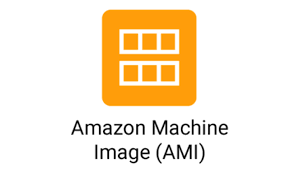

# Node.js Application Deployment Using AWS EC2 & Nginx


>**This project demostrates a cloud-based deploying of a Node.js application on an AWS EC2 instance,with Nginx configured as a reverse proxy and PM2 managing the application process for high availability and performance and secure HTTP access.
The goal of this project aims to provide,step-by-step guide for deploying scalable and secure web applications in a cloud environment.**

---

##  Before we begin  — What are AWS, EC2 & Linux AMI?

### 🔹AWS (Amazon Web Services):
- A cloud platform by Amazon that provides **computing, storage, networking,** and many other services to build and host **applications** over the **internet.**

  

###  🔹EC2 (Elastic Compute Cloud)
- Amazon EC2 lets you rent virtual machines ("instances")    to deploy and run your software quickly, without worrying about underlying hardware or networking setup.

  .jpeg)

---

### 🔹Linux AMI
* A Linux AMI is a pre-configured template with a Linux operating system used to launch an EC2 instance. It includes the OS and necessary software to start running applications on EC2.

  


## Project objective:
```
- Launch an AWS EC2 instance
- Install Node.js, npm, and required packages
-  Deploy a basic Node.js app
- Configure PM2 to run the app in the background
-  Set up Nginx as a reverse proxy to serve the app on port 80
```

## Tech Stack


 **Node.js** (runtime for backend development
 **Express.js** Web framework for Node.js)                   
 **PM2**        (Background process manager)    
 **Nginx**      (High-performance reverse proxy)             
 **Amazon Linux** (Base operating system for EC2)

## Live Preview

After deployment, access the app via:

- `http://<your-ec2-ip>:3000` – Direct Node.js server access  
- `http://<your-ec2-ip>/` – Via Nginx reverse proxy (port 80)

## 1: setup Instructions

### Step 1: Launch Instance from AWS Console
- Go to AWS management Console → Services → EC2 → Launch Instance
- Select:
   **Amazon Machine Image (AMI)**: Amazon Linux 

  
   **Instance Type**: `t2.micro` (Free tier)
   
  - **Key Pair**: Use existing or create a new one
  - **Security Group**:
    - Allow `SSH (22)`
    - Allow `HTTP (80)`
    - Allow `Custom TCP (3000)` — for Node app

    


   ### Click "Launch instance" to start instance**

    

## Step 2: Install Node.js and npm
```bash
sudo yum install -y nodejs
sudo yum install -y npm
```
 ## 2: Create & Deploy Node.js App

## step 3: Set up Application Folder
```bash
mkdir nodeapp
cd nodeapp
```
## Step 5: Create package.json file
```
 vim package.json
```
## step 6: Create app.js
```
vim app.js
```

## 3: Install Dependencies & Start App
## Step 7: Install Express

- npm install

## Step 8: Start the Application

- systemctl npm start
- Visit: http://<ec2-ip>:3000 to confirm it’s working.

## 4: Run App in Background with PM2
## Step 9: Install & Start with PM2

- sudo npm install -g pm2
- pm2 start app.js

## 5 :Install & Configure Nginx
## Step 10: Install Nginx

- sudo yum install nginx1 -y
- sudo systemctl start nginx
- sudo systemctl enable nginx
- sudo systemctl status nginx
---

## 6: Configure Nginx Reverse Proxy
## Step 11: Edit Nginx Configuration
- sudo vim /etc/nginx/nginx.conf
- add the server block inside nginx.con
- nginx.conf
---

## 7: Restart Nginx

- sudo vim /etc/nginx/nginx.conf
- inside that check the changes
- sudo systemctl restart nginx
---
## 8: Run the App
Open browser:

- http://ec2-public-ip

output:

  


---

**This project successfully demonstrates deploying a Node.js application on AWS EC2 with PM2 for process management and Nginx as a reverse proxy, ensuring reliable, secure, and scalable access to the application over the web.**

---


